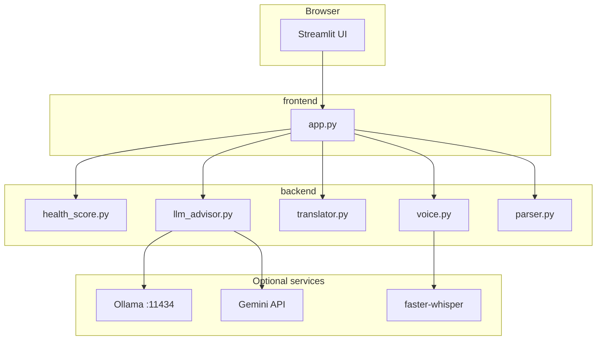

# Artha — Your Money Guide

A **Streamlit** web app for **India-first** personal finance **education**: a transparent **money health score**, **priority actions**, and **plain-language** guidance in **English, Tamil, Hindi, Telugu, and Bengali**. Optional **voice** (local Whisper) and **LLM** explanations via **Ollama** (local) or **Google Gemini** (cloud).

> **Disclaimer:** Artha provides general financial education, not regulated investment advice, tax filing, or product recommendations.

---

## Business impact

- **Inclusive UX** — Multilingual labels and questions; large touch targets for mobile-style use.
- **Low cost to run** — Core scoring works **without** any API keys; Ollama runs on the user’s machine.
- **Actionable output** — Combines a **deterministic score** (auditable logic in code) with **readable** next steps for savings, insurance, tax basics, debt, and SIPs.

---

## Innovation & technical depth

| Area | What we built |
|------|----------------|
| **Hybrid AI** | `health_score.py` encodes rubric-based scoring; `llm_advisor.py` adds narrative. **One combined LLM call** returns both summary and numbered steps (fewer round-trips, faster demos). |
| **Latency** | Capped `num_predict` / `max_output_tokens`, shorter prompts, **single** batched translation for offline fallbacks (instead of many API calls). |
| **Local-first** | `faster-whisper` + Ollama HTTP API (`/api/generate`); `.env` loaded from **repo root** so `streamlit run` from `frontend/` still works. |
| **Streamlit correctness** | Quick-income buttons use a **pending key** applied **before** `st.number_input` binds `home_monthly` (avoids `StreamlitAPIException`). |
| **Skip flow** | Each onboarding question supports **Skip — not applicable** with safe defaults so partial profiles still produce a score. |

---

## Architecture



---

## Setup

### Prerequisites

- **Python 3.11+** (recommended; matches project venv)
- **Git**
- **Ollama** (optional, for local LLM): [ollama.com](https://ollama.com) — install and `ollama pull <model>` (e.g. `qwen2.5:7b`)
- **FFmpeg** on `PATH` (optional, for browser **WebM** voice upload)

### 1. Clone the repository

```bash
git clone https://github.com/Divyapvs/ps9-finance-mentor.git
cd ps9-finance-mentor
```

### 2. Create a virtual environment and install dependencies

**From the repo root** (recommended):

```powershell
python -m venv venv
.\venv\Scripts\activate
pip install -r requirements.txt
```

**From `frontend/`** (same packages via include file):

```powershell
cd frontend
pip install -r requirements.txt
```

### 3. Configure environment variables

Copy `env.example` to **`.env`** in the **project root** (next to `requirements.txt`).

| Variable | Purpose |
|----------|---------|
| `OLLAMA_MODEL` | Model name from `ollama list` (e.g. `qwen2.5:7b`). If unset, LLM uses fallbacks only unless Gemini is set. |
| `OLLAMA_HOST` | Default `http://127.0.0.1:11434` |
| `OLLAMA_NUM_PREDICT` | Max tokens to generate (lower = faster). Default `700`. |
| `OLLAMA_TIMEOUT_SEC` | HTTP timeout. Default `180`. |
| `GEMINI_API_KEY` or `GOOGLE_API_KEY` | If set, Gemini is tried **before** Ollama. |

### 4. Run the app

```powershell
cd frontend
streamlit run app.py
```

Open the **Local URL** shown in the terminal (e.g. `http://localhost:8501`).  
Alternative entry: `streamlit run main.py` from `frontend/`.

---

## Live demo checklist (judges / hackathon)

1. **Language** — Switch EN / தமிழ் / हिन्दी / తెలుగు / বাংলা.
2. **Profile** — Enter **career** + **monthly income** and **spending** (or use a **quick range** chip).
3. **Onboarding** — Answer numerically; use **Skip — not applicable** on at least one question.
4. **Results** — Show **score**, **radar**, **summary**, and **numbered plan** (Ollama/Gemini or fallback).
5. **X-Ray tab** — Upload a sample **CAMS PDF** (optional) for parser + tips.

---

## Build process & version history

All changes are tracked on **`main`** in GitHub. Inspect the evolution of the product:

```bash
git log --oneline --decorate -20
```

Notable themes in history: backend modules wired for Streamlit, Whisper + Ollama integration, session-state fixes, combined LLM path for speed, README and UX for skips and plain language.

---

## Project layout

```
ps9-finance-mentor/
├── backend/           # Scoring, LLM, translation, voice, PDF parser
├── frontend/          # Streamlit app (app.py, main.py)
├── requirements.txt   # Python dependencies
├── env.example        # Template for .env
└── README.md          # This file
```

---

## Contributing

Use **branches + pull requests** and keep commits focused with clear messages. Do not commit `.env` or large binaries (e.g. local `ffmpeg.zip`).

---

## Acknowledgements

Built with **Streamlit**, **Plotly**, **pdfplumber**, **faster-whisper**, **Ollama**, and optional **Google Generative AI**.
